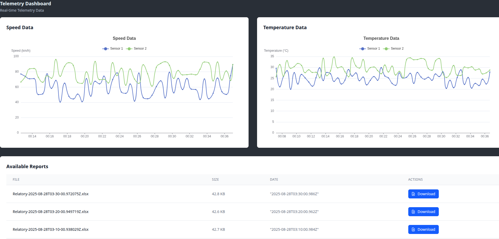

# Sensorhub Telemetry System


This project is a **demonstration of concepts** and integrations using modern Elixir technologies for telemetry collection, processing, visualization, and distribution, including an implementation of distributed, unique processes using Horde and :via tuples to ensure high availability across clustered nodes.

> This is not production-ready software. The goal is to showcase and test various technologies and their interactions in a shallow but illustrative way.

---

##  Features

- **Real-time Data Ingestion** using RabbitMQ, Broadway and NodeRED to simulate an edge environmentgi.
- **Live Dashboard** built with Phoenix LiveView, displaying:
  - Real-time telemetry charts (speed, temperature, etc.)
  - Historical data from MongoDB or fallback to mock data
  - Downloadable Excel reports every 10 minutes
- **Telemetry Storage**:
  - Timeseries data stored in MongoDB or PostgreSQL
  - Periodic reports stored in MinIO (S3-compatible)
- **Scheduled Jobs** with Oban and CRON to generate reports
- **Sensor Management** via PostgreSQL
- **Live PubSub Broadcasting** to update charts in real-time
- **Modular Umbrella Architecture** for better scalability and isolation

---

##  Technologies Used

- **Elixir + Phoenix LiveView**
- **Broadway + RabbitMQ** for message processing
- **Oban** for job scheduling and CRON-based automation
- **Horde** for distributed supervision and registry
- **MongoDB** (optional) for timeseries telemetry
- **PostgreSQL** for sensor metadata
- **MinIO (S3)** for file storage
- **Elixlsx** for generating Excel reports

---

## Overview

The Sensorhub system includes:

- **Elixir umbrella project** with multiple apps
- **Data ingestion from RabbitMQ (MQTT)** using [`Broadway`](https://hexdocs.pm/broadway)
- **MongoDB** (via `mongodb_driver`) for time-series storage
- **PostgreSQL** for structured data (e.g., sensors metadata)
- **MinIO** used as an S3-compatible object storage for Excel reports
- **LiveView** dashboard with real-time telemetry visualization
- **Report generation** every 10 minutes using [`Oban`](https://hexdocs.pm/oban) scheduled jobs
- **Excel export** using [`Elixlsx`](https://hexdocs.pm/elixlsx)
- **PubSub broadcasting** for real-time telemetry streaming
- **Clustered system with High Availability (HA)** using `Horde` and `:via` tuples for distributed supervision and registry

---


## Live Dashboard

- Displays real-time and historical telemetry for each sensor
- Charts update live using Phoenix PubSub
- Downloadable reports section shows the latest Excel files generated

---

### Dashboard Screenshot

You can place a dashboard screenshot image here by adding it to the repository:



---

## Folder Structure

```
apps/
├── sensorhub_elixir            # Core domain logic
├── sensorhub_elixir_cluster    # Cluster management
├── sensorhub_elixir_jobs       # Background jobs and Oban workers
├── sensorhub_elixir_mqtt       # Broadway pipeline for RabbitMQ
├── sensorhub_elixir_timeseries # Timeseries data storage
├── sensorhub_elixir_web        # Phoenix LiveView UI
```

---

## Setup & Development
Make sure you have Docker + Elixir installed.

```bash

docker compose down --remove-orphans && docker compose up -d

mix setup

iex -S mix phx.server

```

---

## CRON Job

A background job runs every **10 minutes** to:
- Query telemetry from the last 10 minutes
- Generate an Excel report
- Upload to MinIO

---


